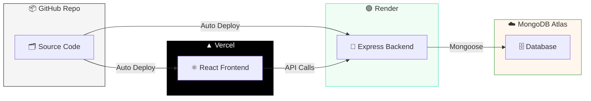

<div align="center">

<!-- Animated Typing Header -->


<br/>

<!-- Tech Stack Badges - Animated -->


<br/><br/>

<!-- Deployment & Status Badges -->
[](https://vercel.com)
[](https://render.com)
[](https://www.mongodb.com)
[](LICENSE)

<br/>

*A full-stack campus management platform for managing students, departments, attendance, and more.*

</div>

---

## 🏗️ Architecture — Tech Stack Flow

<div align="center">

<picture>
  <source media="(prefers-color-scheme: dark)" srcset="./docs/tech-stack-flow-dark.svg">
  <source media="(prefers-color-scheme: light)" srcset="./docs/tech-stack-flow-light.svg">
  
</picture>

</div>

> 💡 *The diagram above is animated and auto-adapts to your GitHub theme — try switching between light and dark mode!*
> 
> 📥 **[Download the fully interactive version →](./docs/tech-stack-flow.html)** *(open in browser for click-to-explore details)*

---

## ✨ Features

<table>
<tr>
<td>

### 🔐 Auth & Security
- JWT login/signup with **6 roles**
- Account lockout (5 attempts → 15min)
- Force password reset on first login
- Protected & role-based routes

</td>
<td>

### 👥 User Management
- Full CRUD with role assignment
- Auto-generated department codes
- Soft delete (Active/Inactive filter)
- MUI Confirmation Dialogs

</td>
</tr>
<tr>
<td>

### 📤 Bulk Upload
- Excel (`.xlsx`) & CSV support
- Auto-generates username from email
- Default password: `Default@123`
- One-click template download

</td>
<td>

### 📊 Attendance & Reports
- Trainer/TA attendance marking
- Attendance history & reports
- Learner performance tracking
- Daily updates system

</td>
</tr>
</table>

---

## 🧱 Tech Stack

<table>
<tr>
<th align="center">Frontend</th>
<th align="center">Backend</th>
<th align="center">DevOps</th>
</tr>
<tr>
<td>

<br/>
<br/>
<br/>
<br/>
<br/>
<br/>


</td>
<td>

<br/>
<br/>
<br/>
<br/>
<br/>


</td>
<td>

<br/>
<br/>
<br/>
<br/>


</td>
</tr>
</table>

---

## 🗂️ Project Structure

```
New-Campus-Management/
├── 📁 frontend/
│   ├── 📁 src/
│   │   ├── 📁 components/
│   │   │   ├── 🔒 auth/          ← ProtectedRoute, RoleBasedRoute
│   │   │   ├── 📐 layout/        ← MainLayout, Sidebar
│   │   │   ├── 🧩 ui/            ← DataTable, ConfirmDialog
│   │   │   └── ⚠️ common/        ← ErrorBoundary
│   │   ├── 📁 pages/
│   │   │   ├── 👑 Admin/         ← Departments, Users, Batches
│   │   │   ├── 🎓 Trainer/       ← Attendance, DailyUpdates
│   │   │   ├── 📚 Learner/       ← Attendance, Performance
│   │   │   ├── 📊 Manager/       ← DailyUpdates review
│   │   │   ├── 📈 Reports/       ← AttendanceHistory
│   │   │   ├── 🔑 Login.jsx
│   │   │   ├── 📝 Signup.jsx
│   │   │   └── 🔄 ResetPassword.jsx
│   │   ├── 📁 store/slices/      ← authSlice (Redux)
│   │   ├── 📁 services/          ← Axios API calls
│   │   └── ⚛️ App.jsx
│   └── ⚡ vite.config.js
│
├── 📁 backend/
│   ├── 🛣️ routes/                ← Express route definitions
│   ├── ⚙️ controllers/           ← Business logic
│   ├── 🍃 models/                ← Mongoose schemas
│   ├── 🛡️ middleware/            ← Auth middleware
│   ├── 🔧 utils/                 ← Logger utilities
│   └── 🚀 server.js
│
├── 📋 MASTER_PROMPT.md           ← AI session context
└── 📖 README.md
```

---

## 🚀 Getting Started

### Prerequisites


### 1. Clone the Repository
```bash
git clone https://github.com/Diganta18-noob/New-Campus-Management.git
cd New-Campus-Management
```

### 2. Setup Backend
```bash
cd backend
npm install
```

Create `backend/.env`:
```env
MONGO_URI=mongodb://localhost:27017/campus-management
JWT_SECRET=your_super_secret_jwt_key
JWT_EXPIRE=7d
BCRYPT_SALT_ROUNDS=10
PORT=5000
CORS_ORIGIN=http://localhost:5173
```

```bash
npm run dev       # 🟢 Server runs on http://localhost:5000
```

### 3. Setup Frontend
```bash
cd frontend
npm install
```

Create `frontend/.env`:
```env
VITE_API_URL=http://localhost:5000
```

```bash
npm run dev       # 🔵 App runs on http://localhost:5173
```

---

## 🔑 Default Credentials

| Role | Email | Password | Notes |
|------|-------|----------|-------|
| 👑 Admin | *(create via signup)* | *(your password)* | Full access |
| 📚 Bulk Students | *(from Excel upload)* | `Default@123` | Forced password reset |

> ⚠️ **Bulk-uploaded students must change their password on first login.**

---

## 📤 Bulk Student Upload

```mermaid
flowchart LR
    A["📥 Download\nTemplate (.xlsx)"] --> B["✏️ Fill Student\nData"]
    B --> C["📤 Upload File\n(.xlsx or .csv)"]
    C --> D["⚙️ Backend\nProcessing"]
    D --> E["✅ Accounts\nCreated"]
    E --> F["🔐 Student Logs In\n(Default@123)"]
    F --> G["🔄 Force\nPassword Reset"]
    G --> H["🎉 Dashboard\nAccess"]

    style A fill:#DBEAFE,stroke:#3B82F6
    style B fill:#FEF3C7,stroke:#F59E0B
    style C fill:#D1FAE5,stroke:#10B981
    style D fill:#EDE9FE,stroke:#8B5CF6
    style E fill:#D1FAE5,stroke:#10B981
    style F fill:#FEE2E2,stroke:#EF4444
    style G fill:#FEF3C7,stroke:#F59E0B
    style H fill:#D1FAE5,stroke:#10B981
```



### Excel Template Format

| firstname | lastname | email | rollnumber | phone | cohortid |
|-----------|----------|-------|------------|-------|----------|
| Alice | Demo | alice@example.com | D001 | 1234567890 | BATCH-2026-A |
| Bob | Test | bob@example.com | D002 | 9876543210 | BATCH-2026-A |

---

## 🌐 Deployment



### Frontend → Vercel
1. Connect GitHub repo to [Vercel](https://vercel.com)
2. Set root directory: `frontend`
3. Add env: `VITE_API_URL=https://your-backend.onrender.com`

### Backend → Render
1. Create **Web Service** on [Render](https://render.com)
2. Set root directory: `backend`
3. Build: `npm install` · Start: `node server.js`
4. Add all env vars from `backend/.env`

> ⚠️ Render free tier spins down after inactivity (~30s cold start).

---

## 🐛 Troubleshooting

| Problem | Solution |
|:--------|:---------|
| 🔴 API calls failing | Check if Render backend is awake (cold start ~30s) |
| 🟡 CORS errors | Ensure `CORS_ORIGIN` matches your frontend URL |
| 🔴 Login not working | Verify `VITE_API_URL` points to correct backend |
| 🟡 MongoDB error | Check `MONGO_URI` is valid, IP whitelisted in Atlas |
| 🔴 JWT errors | Ensure `JWT_SECRET` matches and token hasn't expired |
| 🟡 `npm run dev` fails | Run `npm install` first in both directories |

---

## 🗺️ Roadmap

| Feature | Status |
|---------|--------|
| 🔔 Real-time notifications (Socket.IO) | 🔲 Planned |
| 💰 Fee payment module | 🔲 Planned |
| 📅 Timetable / schedule management | 🔲 Planned |
| 📄 Export data as PDF/CSV | 🔲 Planned |
| 📧 Email notifications (Nodemailer) | 🔲 Planned |
| 🔷 Migrate to TypeScript | 🔲 Planned |
| 🧪 Unit tests (Jest + Supertest) | 🔲 Planned |
| 🐳 Docker containerization | 🔲 Planned |

---

## 🤝 Contributing

1. **Fork** the repo
2. **Branch:** `git checkout -b feature/awesome-feature`
3. **Commit:** `git commit -m 'feat: add awesome feature'`
4. **Push:** `git push origin feature/awesome-feature`
5. **PR:** Open a Pull Request

---

## 📄 License

This project is open source and available under the [MIT License](LICENSE).

---

<div align="center">


[](https://github.com/Diganta18-noob)

</div>
